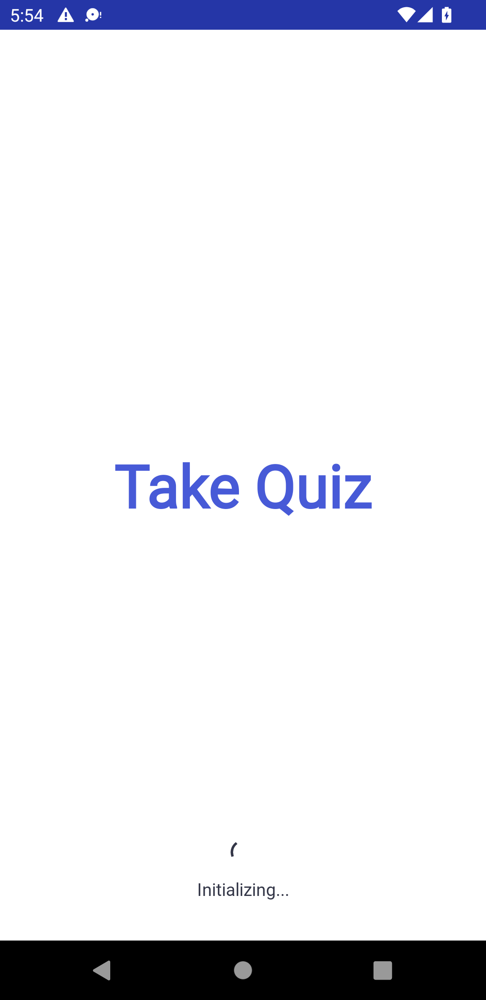
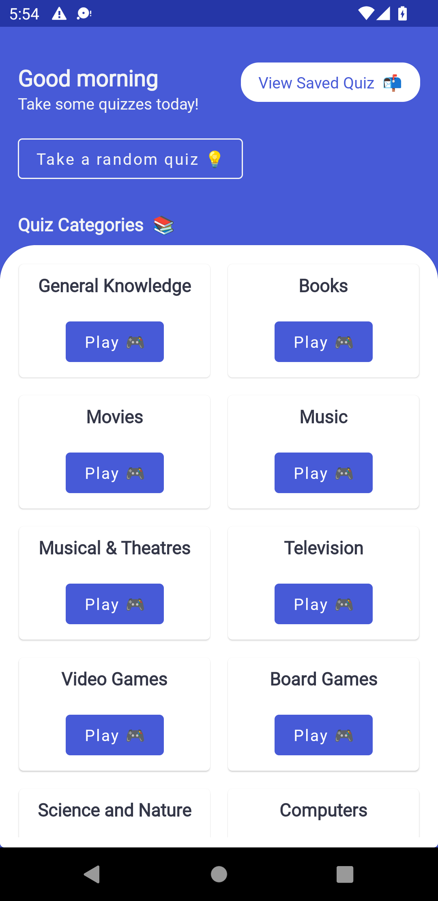
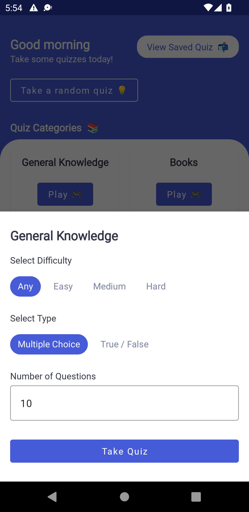
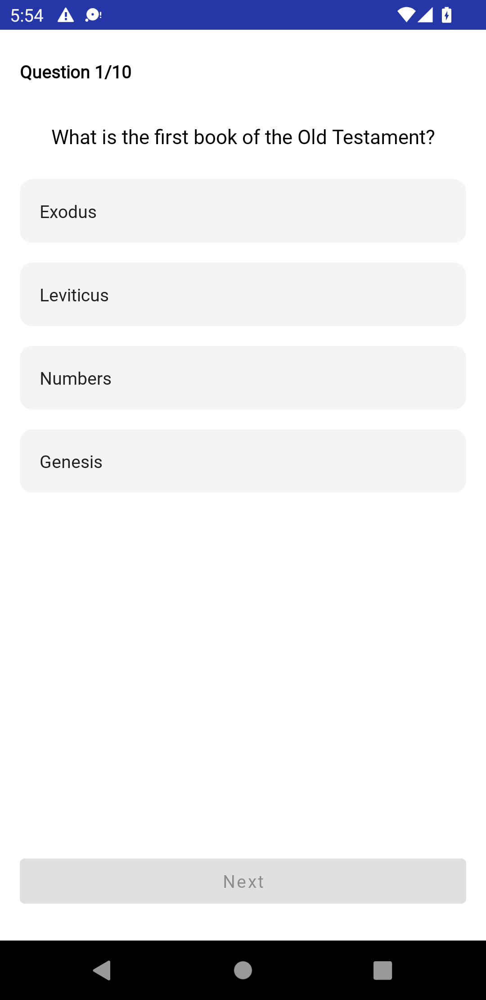
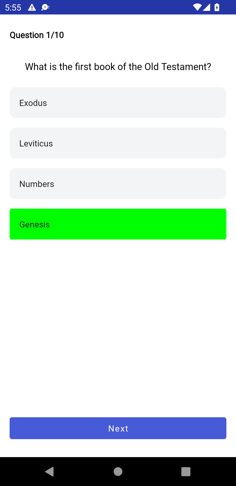
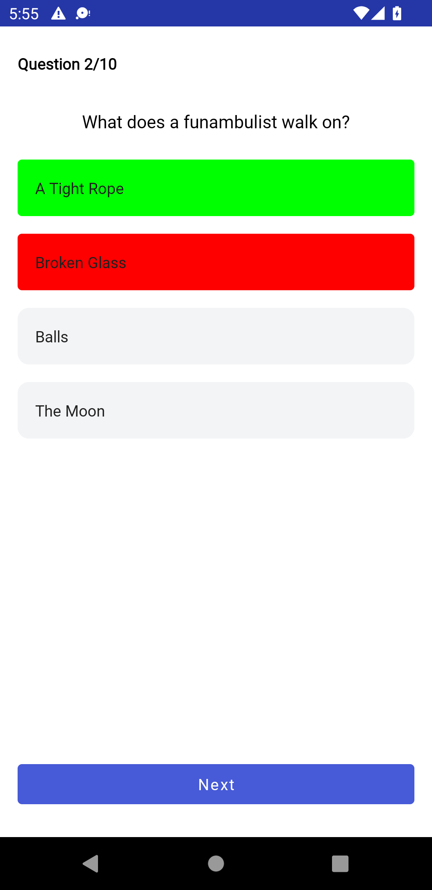
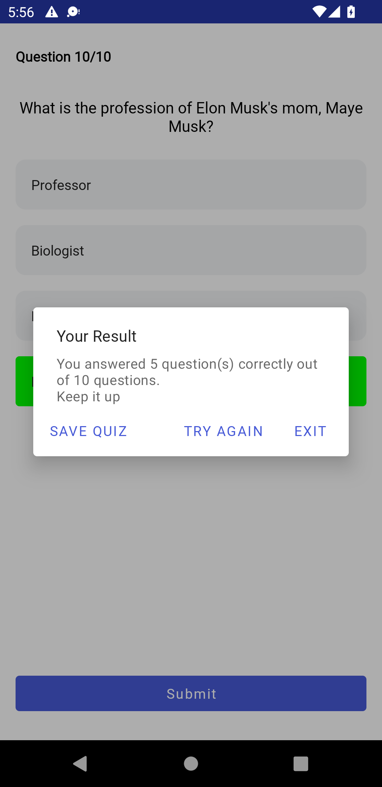
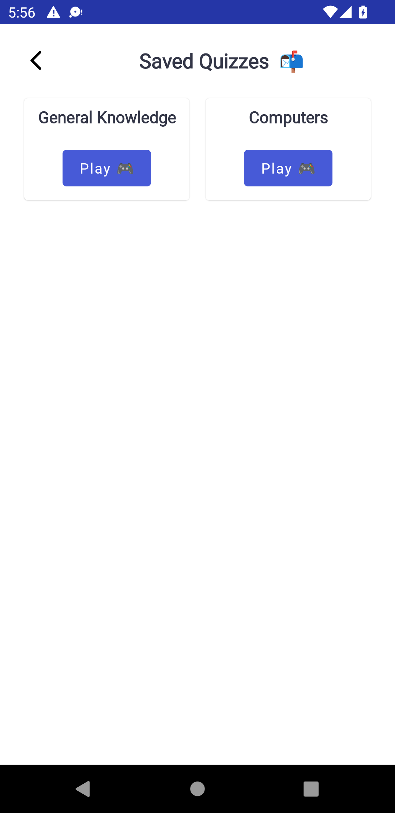
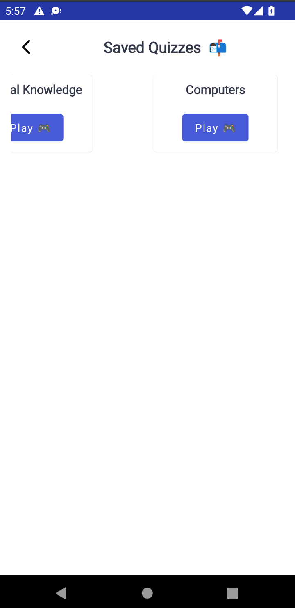
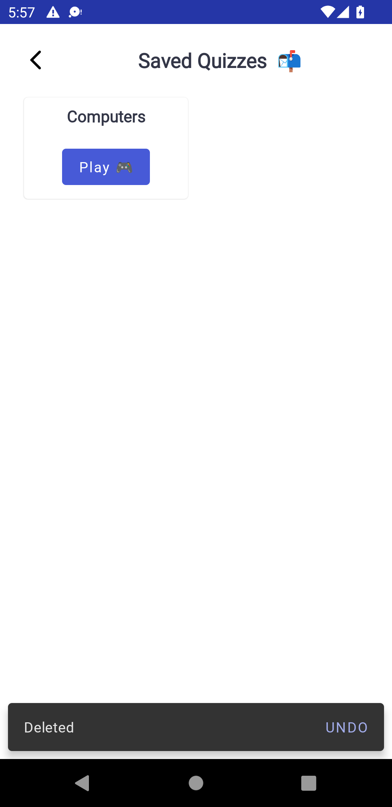

# Take_Quiz App

A quiz app built with Trivia API (https://opentdb.com/api.php)
This app was built with mvvm architecture, dagger-hilt, retrofit, room database, and navigation components.  

Download the app https://github.com/Stephen-Odumirin/Take_Quiz/blob/master/app/app-release.apk

## Screenshots

| Splash Screen | Home Screen | 
|    :---:     |     :---:      |  
|    |    |

| Bottom Dialog | Quiz Screen 1 |
|    :---:     |     :---:    |
|  |    |

| Quiz Screen 2 | Quiz Screen 3 |
|    :---:     |     :---:    |
|  |    |

| Quiz Screen Result | Saved Quiz Screen |
|    :---:     |     :---:    |
|  |    |

| Swipe to Delete 1 | Swipe to Delete 2 |
|    :---:     |     :---:    |
|  |    |

## Contributions

Feel free to contribute to this project.
